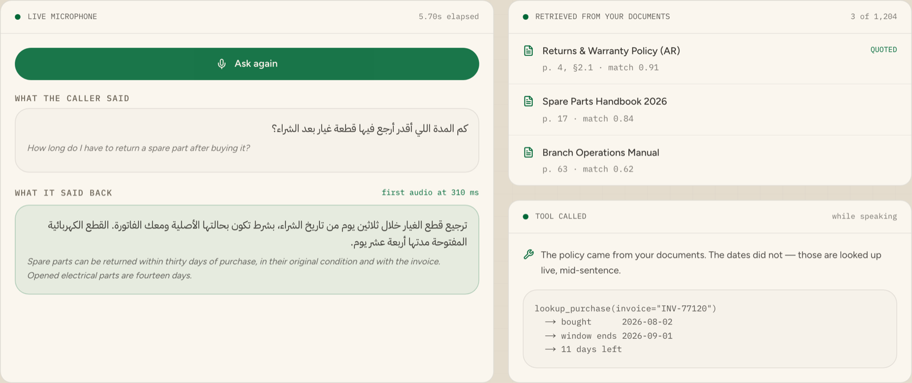

# Real-Time Arabic Voice Agent — Najdi

> Answers a caller from your own documents, and starts speaking before it has finished writing the sentence.

Built for Saudi Arabia. The agent answers in **Najdi Arabic** — the dialect of
Riyadh and central Saudi Arabia — from a knowledge base you control, and cites
the document and section every answer came from.

<p align="center">
  <a href="https://voho.ai/demos/realtime-arabic-rag">
    
  </a>
</p>

<p align="center">
  <b><a href="https://voho.ai/demos/realtime-arabic-rag">▶ Play the live demo</a></b> — runs in your browser, no sign-up.
</p>

<!-- voho:try -->
## Try it in your browser first

You do not have to clone anything to see whether this works for you. The same
engine this repository calls is running at **[app.voho.ai/agents](https://app.voho.ai/agents)** —
build an agent and talk to it out loud, in the browser, in about a minute.

New accounts start with **$25 of credit**, and one balance and one API key
cover every Voho product: AI Call Center, and the five beside it.

- **[Build an agent and talk to it out loud →](https://app.voho.ai/agents)**
- [Get an API key](https://app.voho.ai/tokens) — the key this repository needs
- [Read the API docs](https://docs.voho.ai)

Running it inside your own estate, against your own systems, is what we do
with you: [talk to us](https://voho.ai/book-demo).

---

---

## The point

The naive shape is: retrieve → write the whole answer → synthesise it → play
it. Every stage waits for the one before it, and the caller hears silence for
the sum of all four.

This does it differently. Retrieval runs on the question, the model starts
writing, and each token goes into an **open Voho WebSocket** as it arrives.
Audio comes back while the sentence is still being written. The number that
matters is `first_audio_ms` — the gap the caller actually experiences, printed
on every run.

## Two ways to run this

**Let Voho be the whole agent.** A Voho voice agent answers the line, hears the
caller in Saudi Arabic, works out what they actually want, takes the action in
your systems, stops talking the moment it is interrupted, hands over to a
person when it should, and leaves a bilingual transcript and summary behind.
Hearing, deciding and speaking are all Voho's — you configure the agent and its
actions rather than writing any of this. It is the fastest route to a live
line.

**Or assemble it yourself, the way this repository does.** Here the
conversation lives in code you can read line by line, the tools are yours, and
Voho's Speech API provides the voice. Worth it when the script has to be
reviewed before it goes anywhere near a caller, or when every part has to sit
inside your own network.

| Part | In this repository | With a Voho agent |
| --- | --- | --- |
| Hearing the caller | whichever recogniser hands you the text this starts from | Voho |
| Deciding what to do | retrieval plus a model of your choosing | Voho |
| Acting in your systems | [`tools.py`](tools.py), called mid-sentence | Voho actions, calling your API |
| Speaking | Voho, via [`voho.py`](voho.py) | Voho |
| Transcript and summary | yours to keep | Voho, in Arabic and English |

Both end in the same place. Start with whichever suits the team you have.

## Quick start

You need a Voho API key — `setup.py` walks you through getting one at
[app.voho.ai](https://app.voho.ai) under **API Tokens**, checks it against the
live voice catalogue so a typo fails now rather than on a call, and writes it
to `.env`.

```bash
git clone https://github.com/yar-malik/realtime-arabic-voice-agent-najdi.git
cd realtime-arabic-voice-agent-najdi
pip install -r requirements.txt
python setup.py           # asks for your Voho key and verifies it
python examples/ask.py
```

```
  12 passages indexed from knowledge/

───── كم المدة اللي أقدر أرجع فيها قطعة غيار بعد الشراء؟

  يمكن استرجاع قطع الغيار خلال ثلاثين يوماً من تاريخ الشراء…

  · returns and warranty policy, §2 مدة الاسترجاع
  · returns and warranty policy, §4 العيوب المصنعية

  first audio at 310 ms
  out/answer-01.opus · 46 KB
```

Ask your own:

```bash
python examples/ask.py "متى يفتح فرع الرياض يوم الجمعة؟"
```

Add `--no-audio` to run retrieval and generation without spending anything on
speech — the fastest way to check whether your documents actually answer the
question.

## Your own documents

Drop `.md` files into `knowledge/`. They are split on `##` headings, and the
heading becomes the citation, so an answer points at somewhere a person can
actually turn to rather than at a chunk number.

No vector database, no embedding model, no cold start. For a few thousand
passages BM25 retrieves about as well and begins instantly, which matters when
the alternative is loading a model in front of a live caller.

**Arabic needs three things that English does not**, all in `rag.py`:

- **Normalisation** — أ إ آ all become ا, ة becomes ه, tashkeel is stripped.
- **Affixes** — the definite article and common suffixes come off both sides, so الفاتورة and فاتورة are one word.
- **Broken plurals** — Arabic does not pluralise by adding a letter: فرع becomes فروع, changing inside the word. Dropping the internal weak letters approximates the root. Without this, a question about branch opening hours retrieves the escalation procedure, because both mention الفرع.

It is not a morphological analyser. It is the cheap 90%, and it is short enough
to read in one sitting.

## Tools

Retrieval answers *what is the policy*. It cannot answer *how long do I have
left* — that needs the caller's own invoice. [`tools.py`](tools.py) holds a
small registry the model calls mid-sentence:

```python
lookup_purchase(invoice="INV-77120")
  → bought      2026-08-02
  → window ends 2026-09-01
  → 11 days left
```

Keep the set small and the descriptions blunt. A tool the model half
understands is worse than one it does not have.

## The WebSocket protocol

Three frames out, three in:

```python
async with SpeechSession(voice="layla") as speech:
    async for token in llm_tokens():
        await speech.send(token)      # {"type": "text",  "text": "…"}
    await speech.finish()             # {"type": "flush"}
    async for chunk in speech.audio():
        play(chunk)                   # binary frames, in arrival order
```

Audio begins before you have finished sending text. It is genuinely pipelined,
not batched at the end.

## Running inside your own network

Saudi enterprises frequently require that documents and call audio do not leave
the building. Point `VOHO_WS_URL` at your own deployment and `LLM_BASE_URL` at
a self-hosted model — the knowledge base is already local, and nothing else in
the code changes.

## Security

- No key is committed. `.env` is git-ignored; `.env.example` holds placeholders only.
- Rotate keys from the dashboard, and scope one key per environment.

## More Voho examples

| Repository | What it covers | Live demo |
| --- | --- | --- |
| [realtime-arabic-voice-agent-najdi](https://github.com/yar-malik/realtime-arabic-voice-agent-najdi) | Streaming answers from your own documents | [Play it](https://voho.ai/demos/realtime-arabic-rag) |
| [ai-voice-agent-saudi-najdi](https://github.com/yar-malik/ai-voice-agent-saudi-najdi) | Booking appointments by phone | [Play it](https://voho.ai/demos/appointment-booking) |
| [charco-voice-agent-najdi](https://github.com/yar-malik/charco-voice-agent-najdi) | Taking restaurant orders by phone | [Play it](https://voho.ai/demos/restaurant-ordering) |
| [arabic-engineering-ai-copilot](https://github.com/yar-malik/arabic-engineering-ai-copilot) | Asking engineering archives | [Play it](https://voho.ai/demos/engineering-ai) |
| [saudi-arabic-voice-agent](https://github.com/yar-malik/saudi-arabic-voice-agent) | Phone agents in Najdi Arabic | [Play it](https://voho.ai/demos/ai-call-center) |

## Want this in production?

We build the first workflow with you, on your own systems — usually live
within a month.

**[Book a call →](https://voho.ai/book-demo)**

---

MIT licensed. Built by [Voho](https://voho.ai) — enterprise AI for Saudi Arabia.
